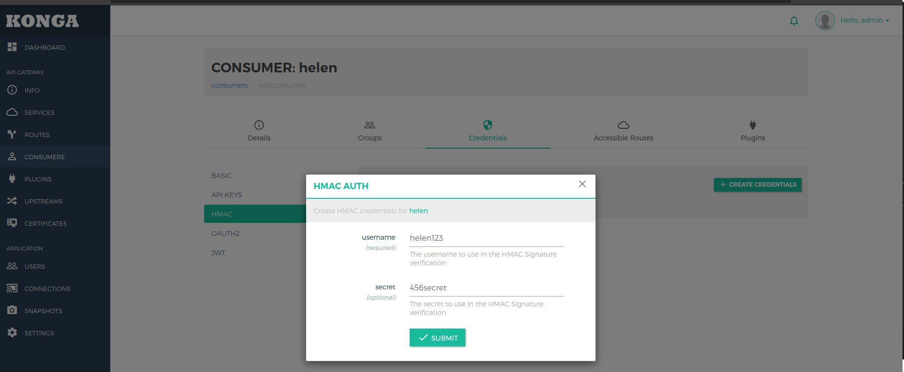

# Rest API

# Example Case with need API Management

API in Real Life


API Consumers


Add API Management


API Consumers with API Management 


Management

## Run dependences

```bash
docker run -it --rm --name rabbitmq -p 15672:15672 -p 5672:5672 rabbitmq:3-management
#http://localhost:15672
#guest guest
```

## Install Docker Compose

```bash
sudo curl -L "https://github.com/docker/compose/releases/download/v2.5.0/docker-compose-$(uname -s)-$(uname -m)" -o /usr/local/bin/docker-compose
sudo chmod +x /usr/local/bin/docker-compose
docker-compose --version
```

## Run Kong

```bash
docker-compose up -d
docker-compose ps
```

Commands Docker Compose

```bash
#Create all containers, without start them.
docker-compose up --no-start

#Start all containers.
docker-compose start

#Stop all running containers.
docker-compose stop
```

view kong
http://localhost:8001

view konga
http://localhost:1337

view service example
http://localhost:9001/

Docker Network Kong


Use Postman to use Kong

Set Environment Kong


Get in API Kong


## Ports Kong


## Kong Services

Add Service


## Kong Routes

Add Route


http://localhost:8000/qr
http://goqr.me/api/doc/
http://localhost:8000/qr/v1/create-qr-code/?data=Hello

Service QR in Kong


### Update Endpoint Service


## Kong Consumers

Add Consumers


## Konga

http://localhost:1337/register

Conexion with Kong


Add Service


Add Route on Service


View Route on Service on Web Browser


Add Consumer


Documentation: https://pantsel.github.io/konga/

Add User


Take Snapshot Backup


Restore from file Snapshot


Sheduler Snapshot Backup


## HealthCheck and LoadBalancer


### Upstream

In Konga


In Postman


Current Schema


Change Host Service by Upstream


### Enable Alerts of Slack


## Services & API

### Service Alfa

* Base URL: http://localhost/alpha
* List of available endpoints: Alpha http://localhost/alpha/swagger-ui.html

### Service Beta

* Base URL: http://localhost/beta
* List of available endpoints: Alpha http://localhost/beta/swagger-ui.html

### Service Gamma

* Base URL: http://localhost/gamma
* List of available endpoints: Alpha http://localhost/gamma/swagger-ui.html

### Service Omega

* Base URL: http://localhost/omega
* List of available endpoints: Alpha http://localhost/omega/swagger-ui.html

## Plugin Basic Authentication on Konga


## Plugin API Key on Konga

Add API Key on an Service


## Plugin HMAC on Konga




Generator: https://dinochiesa.github.io/hmachash/index.html


